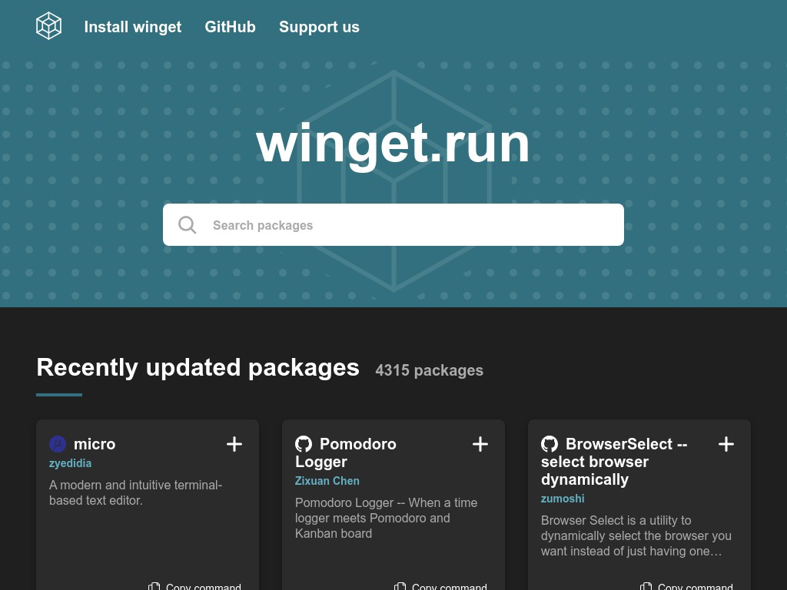

<h1 align="center">-WinGet-Program-Installer-</h1>

- **Установка программ с помощью WinGet из списка приложения.**
- **Создание вашего собственного списка приложений и их установка.**

## Требования
- **.Net 8**
- **Windows 10 - Windows11**

## Использование программы
1. Запустите файл WPF_INSTALL_APP.exe

2. Выберите программы для установки и нажмите кнопку Install.

## Создание своего списка для установки
1. Перейдите на [Сайт](https://winget.run/)
<p> 

2. В поиске напишите название программы для списка.

3. Скопируйте команду для WinGet и вставьте её в файл Command.txt

```bash
Пример команды:
winget install -e --id Discord.Discord
```

4. Если файла Command.txt нет в каталоге программы, создайте его.

5. Когда файл Command.txt создан и вы вставили команды для установки, запустите файл NoGui.exe.
